# Contrastive Learning for Protein Binding
CS 101 Project 
Contributors: Ayush Varshney, Emily Pan, Evan Zhang, Jadelynn Dao

## Abstract
This study delves into the innovative application of advanced machine learning frameworks, primarily CLIP (Contrastive Language–Image Pretraining) and FILIP, for predicting protein-protein binding interactions. We have extended the utility of these models beyond their conventional domains by implementing and fine-tuning them to address the complex challenges in bioinformatics. Our approach encompasses the integration of gradient caching to enhance computational efficiency, and the novel application of contrastive learning techniques. This research not only demonstrates the feasibility of using these models for prediction of protein-peptide interactions but also explores their potential in understanding protein-protein binding mechanisms. Our work represents a significant leap in computational biology, offering new pathways for drug discovery and therapeutic development.

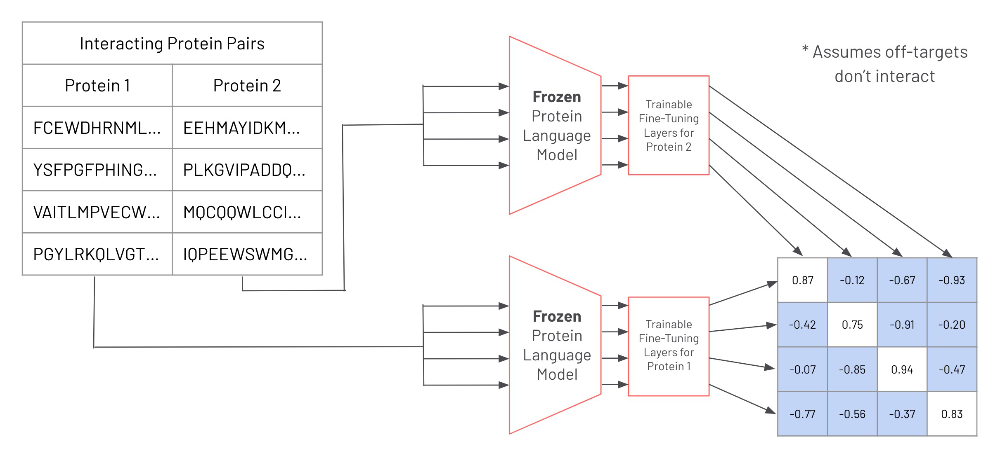


# Documentation

#### TL;DR: 

Running ```main.py``` extracts peptide-receptor data from Propedia and trains a CLIP model. 

Running ```main_2protein.py``` extracts protein-protein data from PDB and trains a CLIP model. 

Running ```main_2protein_filip.py``` extracts protein-protein data from PDB and trains a FILIP model. 

Model versioning is based on the time of the run, so the model and losses will be saved to a directory determined by the year, month, day, hour, minute, and second training begins.


## Environment Setup

### If you are running locally:

Create a new Anaconda environment from ```environment.yml``` using the command
    > ```conda env create -f environment.yml```

By default, Anaconda will install a CPU-only version of PyTorch. If you have access to a GPU, please [install](https://pytorch.org/get-started/locally/) the correct version of PyTorch for you.

To run the scripts, simply execute the specified file using Python 3 from the Anaconda distribution.

### If you are running on HPC: 

Create a new Anaconda environment from ```environment_hpc.yml``` using the command
    > ```conda env create -f environment_hpc.yml```

To run the scripts, follow the documentation for your specific computing cluster. 

For examples specific to Caltech HPC, please refer to the corresponding files in the ```hpc_bash_scripts``` folder

## Default Parameters
We have done a degree of hyperparameter tuning and arrived at the current model with the following parameters. You are welcome to iterate on our work! 

- ```mmseqs2 min-seq-id = 0.5```
- ESM Tokenizer: ```facebook/esm2_t30_150M_UR50D```
- Embedding dimension ```128```
- Feedforward network layers ```h1 = 2, h2 = 2```
- Dropout rate: ```0.1```
- Batch size ```16``` + gradient Accumulation ```16``` = total batch size ```256```

## Peptide-Receptor CLIP

The peptide-receptor CLIP model should be run using the script ```main.py```. The shell file corresponding for HPC usage is ```run-main.sh```. 

Running this script will pull the 19.814 peptide-receptor pair dataset from [Propedia](http://bioinfo.dcc.ufmg.br/propedia/). The dataset will be clustered using the [mmseqs2](https://github.com/soedinglab/MMseqs2) library. 

The dataset will be automatically processed and divided into a 70\% training, 15\% testing, and 15\% validation split.

For each epoch, the losses are recorded, which should save to a timestamp-labeled folder. Additionally, the cosine similarity matrix using the training and validation set for each epoch will be saved. 


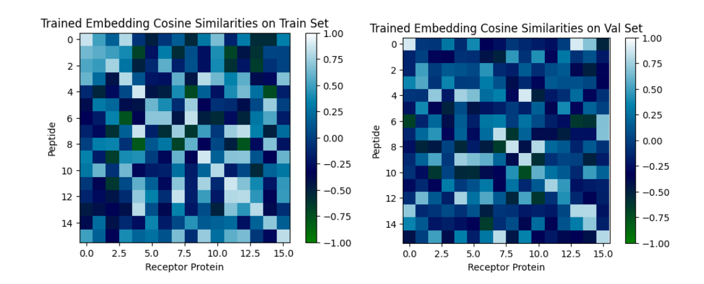
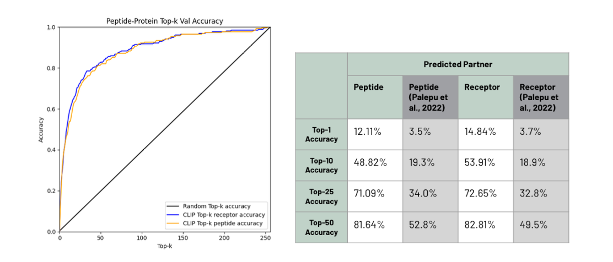

## Protein-Protein CLIP 

The protein-protein CLIP model should be run using the script ```main_2protein.py```. The shell file corresponding for HPC usage is ```run-main_2protein.sh```. 

Running this script will scrape the [Protein Data Bank](https://www.rcsb.org/) for all 2-protein interactions. The dataset will be clustered using the [mmseqs2](https://github.com/soedinglab/MMseqs2) library. 

The dataset will be automatically processed and divided into a 70\% training, 15\% testing, and 15\% validation split.

For each epoch, the losses are recorded, which should save to a timestamp-labeled folder. Additionally, the cosine similarity matrix using the training and validation set for each epoch will be saved. 

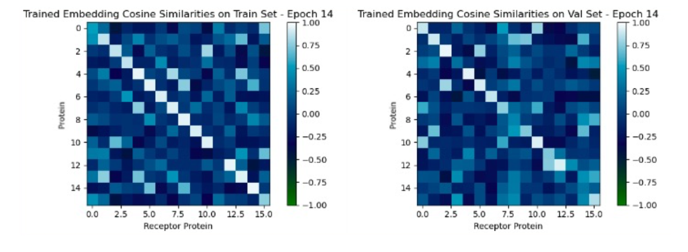
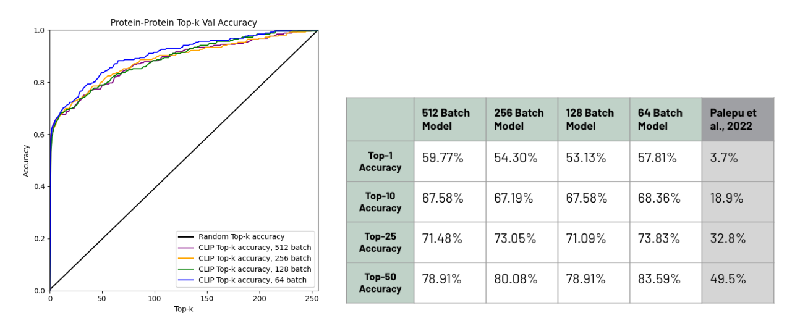

## Protein-Protein FILIP 

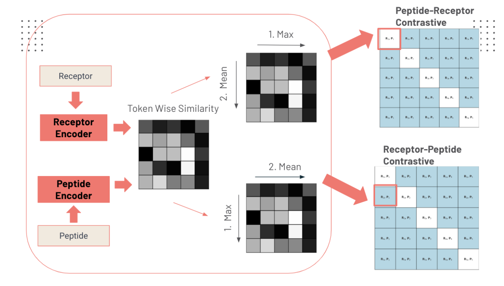

The protein-protein FILIP model should be run using the script ```main_2protein_filip.py```. The shell file corresponding for HPC usage is ```run-main_filip.sh```. The dataset will be clustered using the [mmseqs2](https://github.com/soedinglab/MMseqs2) library. 

Running this script will scrape the [Protein Data Bank](https://www.rcsb.org/) for all 2-protein interactions. The dataset will be clustered using the [mmseqs2](https://github.com/soedinglab/MMseqs2) library. 

The dataset will be automatically processed and divided into a 70\% training, 15\% testing, and 15\% validation split.

For each epoch, the losses are recorded, which should save to a timestamp-labeled folder. Additionally, the cosine similarity matrix using the training and validation set for each epoch will be saved. 

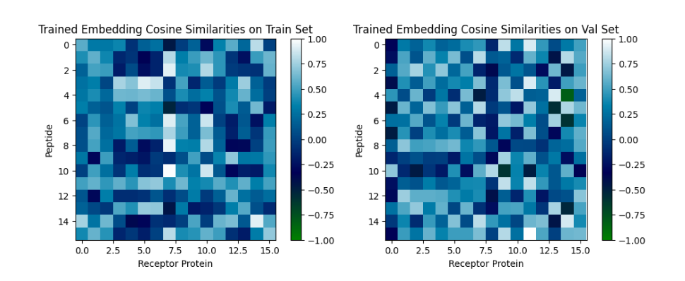


## Masked Language Model 

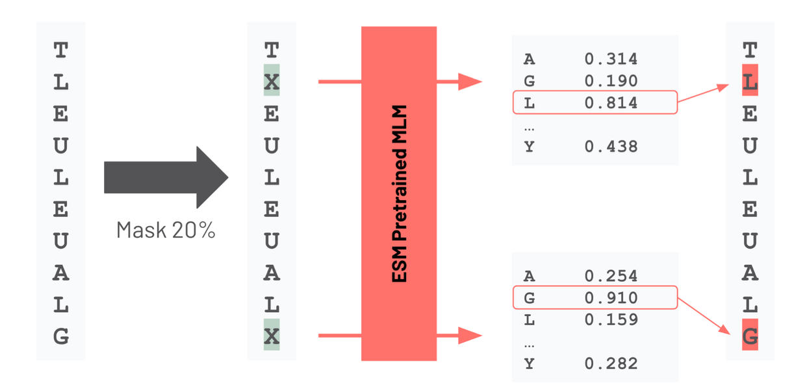

Experimentation with the masked language model was largely ad-hoc. See ```notebooks/MLM_Testing.ipynb```. 

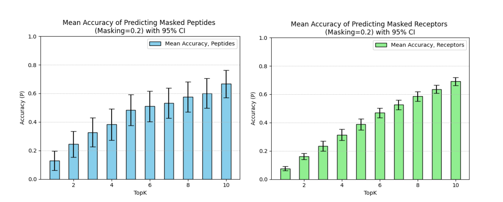
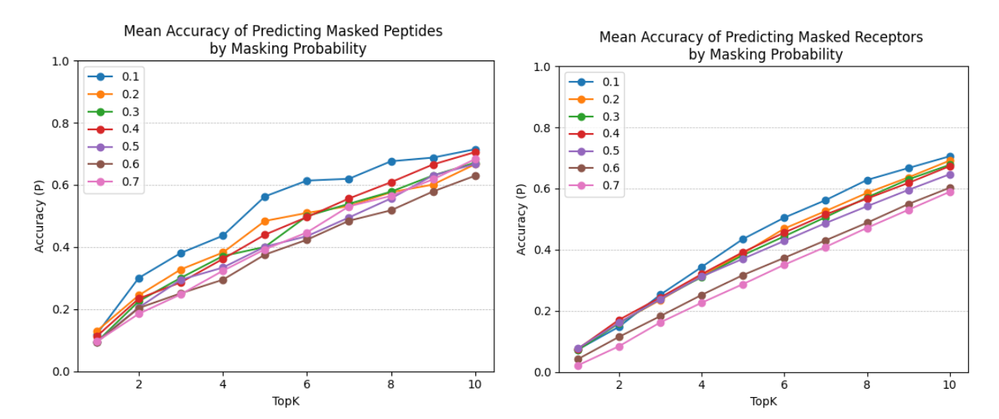


## Visualizations

Most visualizations can be found directly in the module ```visualizations.py```. 

### Cosine Similarity Matrix 

Generate joint embedding cosine similarities by running ```cosine_similarity.py``` or ```run-cosine_similarity.sh```. This will display the model's ability to align embeddings for binding proteins (shown on the diagonal) and disperse embeddings for non-binding proteins (shown on the off-diagonals) in a batch of ```16``` pairs.

Make sure to modify the ```model_save_path``` to wherever the model you want to test is, currently it is set to one of our models on Caltech HPC that uses protein-protein data. Replace ```data_utils_2protein.generate_datasets()``` with ```data_utils.generate_datasets()``` if you wish to test a model trained on peptide-receptor data instead.

### Top-k Accuracy 

Generate top-k accuracies by running ```topk.py``` or ```run-topk.sh```. This will test the model on predicting the correct binding partner for a protein out of a batch of ```256``` candidates ranked by joint embedding cosine similarity for each protein in the batch.

Again, make sure to modify the ```model_save_path``` to wherever the model you want to test is, currently it is set to one of our models on Caltech HPC that uses protein-protein data. Replace ```data_utils_2protein.generate_datasets()``` with ```data_utils.generate_datasets()``` if you wish to test a model trained on peptide-receptor data instead.

### Principal Component Analysis 

Although PCA is not availible in our visualizations module, it can be referenced in ```notebooks/batchwise_pca```. This will generate a 2-D Principal Component Analysis and plot the points on a 2d plane. 

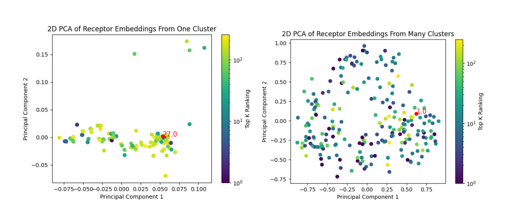
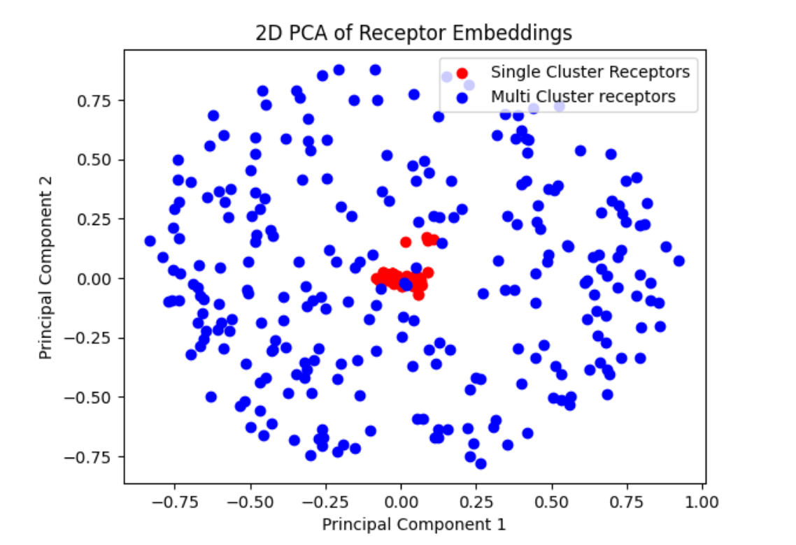


# References
1. A. Radford, J. W. Kim, C. Hallacy, A. Ramesh, G. Goh, S. Agarwal, ... I. Sutskever. (2021). [Learning Transferable Visual Models From Natural Language Supervision. ](https://arxiv.org/pdf/2103.00020.pdf)
2. Kalyan Palepu, Manvitha Ponnapati, Suhaas Bhat, Emma Tysinger, Teodora Stan, Garyk Brixi, Sabrina R.T. Koseki, Pranam Chatterjee. (2022). [Design of Peptide-Based Protein Degraders via Contrastive Deep Learning. ](https://doi.org/10.1101/2022.05.23.493169)
3. Y. Yao, C. Li, G. Gao, and P. Kohli. (2021). [FILIP: Fine-grained Interactive Language-Image Pre-Training. ](https://arxiv.org/abs/2111.07783 )
4. Gao, L., Zhang, Y., Han, J., & Callan, J. (2021). [Scaling Deep Contrastive Learning Batch Size under Memory Limited Setup.]( https://arxiv.org/abs/2101.06983 )