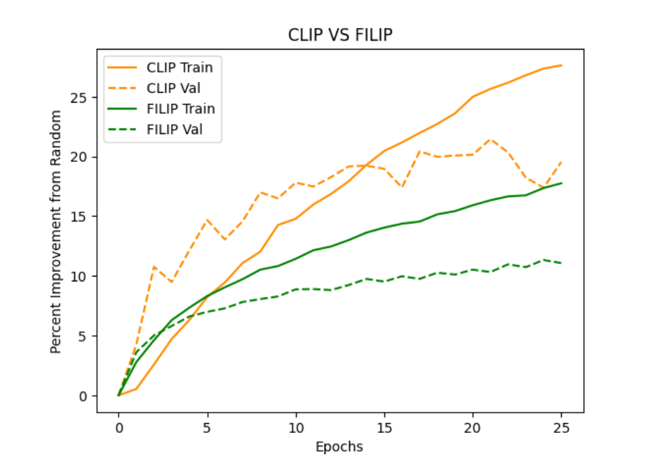

# CLIP Model for Peptide-Receptor Interactions
CS 101 Project 
Contributors: Ayush Varshney, Emily Pan, Evan Zhang, Jadelynn Dao

## Abstract
This study delves into the innovative application of advanced machine learning models, primarily CLIP (Contrastive Language–Image Pretraining) and FILIP, for predicting protein-protein binding interactions. We have extended the utility of these models beyond their conventional domains by implementing and fine-tuning them to address the complex challenges in bioinformatics. Our approach encompasses the integration of gradient caching to enhance computational efficiency, and the novel application of contrastive learning techniques. This research not only demonstrates the feasibility of using these models for prediction of protein-peptide interactions but also explores their potential in understanding protein-protein binding mechanisms. Our work represents a significant leap in computational biology, offering new pathways for drug discovery and therapeutic development.


# Documentation

#### TL;DR: 

Running ```main.py``` extracts proten-receptor data from Propedia, then builds + trains a CLIP model. 

Model versioning is based on time of run, so model/losses will be saved to directory determined by H-M-S we begin training the model. 


## Environment Setup

### If running locally:

Create a new Anaconda environment from ```environment.yml``` using the command
    > ```conda env create -f environment.yml```

Running scripts should simply require you to run the specified file using the anaconda version of python3. 

### If running on HPC: 

Create a new Anaconda environment from ```environment_hpc.yml``` using the command
    > ```conda env create -f environment_hpc.yml```

To run the scripts, follow the documentation for your specific computing cluster. 

To give some examples for Caltech HPC, refer to the corresponding file in ```hpc_bash_scripts``` folder. 

## Default Parameters
We have done a degree of hyperparameter tuning, with the current model at the following parameters. You are welcome to iterate on our work! 

- ```mmseqs2 min-seq-id = 0.5```
- ESM Tokenizer: ```facebook/esm2_t30_150M_UR50D```
- Embedding dimension ```128```
- Feedforward network layers ```h1 = 2, h2 = 2```
- Dropout rate: ```0.1```
- Batch size ```16``` + gradient Accumulation ```16``` = total batch size ```256```

## Peptide-Receptor CLIP

The peptide-receptor CLIP model should be ran using the script ```main.py```. The shell file corresponding for HPC usage is ```run-main.sh```. 

Running this script will pull the 19.814 peptide-receptor pair dataset from [Propedia](http://bioinfo.dcc.ufmg.br/propedia/). The dataset will be clustered using the [mmseqs2](https://github.com/soedinglab/MMseqs2) library. 

The dataset will automatically be processed and divided into a 70\% / 15\% / 15\% train / test / validate split. 

For each epoch, the losses are recorded, which should save to a timestamp-labeled folder. Additionally, the cosine similarity matrix for each epoch will be saved. 


## Protein-Protein CLIP 

The protein-protein CLIP model should be ran using the script ```main_2protein.py```. The shell file corresponding for HPC usage is ```run-main_2protein.sh```. 

Running this script will scrape [Protein Data Bank](https://www.rcsb.org/) for all 2-protein interactions. The dataset will be clustered using the [mmseqs2](https://github.com/soedinglab/MMseqs2) library. 

The dataset will automatically be processed and divided into a 70\% / 15\% / 15\% train / test / validate split. 

For each epoch, the losses are recorded, which should save to a timestamp-labeled folder. Additionally, the cosine similarity matrix for each epoch will be saved. 


## Protein-Receptor FILIP 


The peptide-receptor FILIP model should be ran using the script ```main_2protein_filip.py```. The shell file corresponding for HPC usage is ```run-main_filip.sh```. The dataset will be clustered using the [mmseqs2](https://github.com/soedinglab/MMseqs2) library. 

Running this script will pull the 19.814 peptide-receptor pair dataset from [Propedia](http://bioinfo.dcc.ufmg.br/propedia/). 

The dataset will automatically be processed and divided into a 70\% / 15\% / 15\% train / test / validate split. 

For each epoch, the losses are recorded, which should save to a timestamp-labeled folder. Additionally, the cosine similarity matrix for each epoch will be saved. 



## Masked Language Model 


Experimentation with the masked language model was largely ad-hoc. See ```notebooks/MLM_Testing.ipynb```. 


## Visualizations

Most visualizations can be found directly in the module ```visualizations.py```. 

### Cosine Similarity Matrix 
Refer to the method ```plot_embedding_cosine_similarities``` in the ```visualizations``` module. 

### Top-k Accuracy 
Generate top-k accuracies by running ```topk.py``` or ```run-topk.sh```. This will train the CLIP Model on a batch size of ```256``` and plot the top-k validation accuracy for each pair. 

### Principal Component Analysis 

Principal component analysis modularization is to come. Currently, we have an ad-hoc solution that can be referenced in ```notebooks/batchwise_pca```. This will generate a 2-D Principal Component Analysis and plot the points on a a 2d plane. 


# References
1. A. Radford, J. W. Kim, C. Hallacy, A. Ramesh, G. Goh, S. Agarwal, ... I. Sutskever. (2021). [Learning Transferable Visual Models From Natural Language Supervision. ](https://arxiv.org/pdf/2103.00020.pdf)
2. Kalyan Palepu, Manvitha Ponnapati, Suhaas Bhat, Emma Tysinger, Teodora Stan, Garyk Brixi, Sabrina R.T. Koseki, Pranam Chatterjee. (2022). [Design of Peptide-Based Protein Degraders via Contrastive Deep Learning. ](https://doi.org/10.1101/2022.05.23.493169)
3. Y. Yao, C. Li, G. Gao, and P. Kohli. (2021). [FILIP: Fine-grained Interactive Language-Image Pre-Training. ](https://arxiv.org/abs/2111.07783 )
4. Gao, L., Zhang, Y., Han, J., & Callan, J. (2021). [Scaling Deep Contrastive Learning Batch Size under Memory Limited Setup.]( https://arxiv.org/abs/2101.06983 )